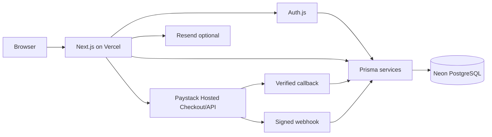
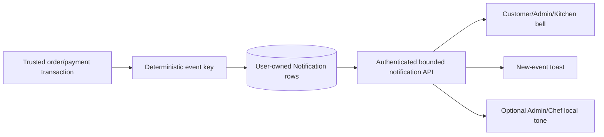

# Kobby's Kitchen System Architecture

## Application shape

Kobby's Kitchen is one Next.js App Router application written in JavaScript/JSX
with plain CSS. Server Components load authenticated and database-owned data.
Client Components are limited to browser interaction: cart persistence, forms,
theme, menus, pickup-code visibility, polling, and Screen Wake Lock.

```text
src/app/                  App Router pages, layouts, and route handlers
src/components/           Reusable presentation and browser interaction
src/data/                 Approved restaurant and static presentation content
src/lib/                  Domain policy, server services, validation, and queries
prisma/schema.prisma      Current relational model
prisma/migrations/        Ordered, immutable schema history
scripts/                  Guarded Development and Production operations
docs/                     Release, architecture, and provider operations
```

Route groups separate marketing, customer, Admin, and Kitchen presentation while
sharing the root theme and global styles. Server page guards and API route guards
are both required; navigation visibility is never treated as authorization.

## Runtime components



Vercel supplies HTTPS runtime and Git-based deployment. Neon is the durable
application database. Paystack owns payment credential entry; Resend is an
optional password-reset delivery dependency.

## Authentication and authorization

Auth.js uses the Prisma adapter with Credentials and Google providers. Passwords
use Argon2id. JWT callbacks refresh identity and role from Prisma instead of
trusting stale provider/client role claims. OAuth metadata can create a default
CUSTOMER profile but cannot assign ADMIN or CHEF.

`src/lib/auth/guards.js` is the server access boundary:

- CUSTOMER-only account and checkout pages resolve the signed-in User and current
  Prisma role.
- `/admin` requires ADMIN.
- `/kitchen` allows CHEF and the intentional ADMIN operational fallback.
- Protected API routes independently repeat the appropriate authorization check.
- Customer order/receipt queries include the authenticated `userId` in their
  database predicate.

Primary Admin and Chef provisioning is performed only by guarded server scripts
against existing Auth.js users. It requires a Production confirmation argument,
separate ignored environment file, exact Neon target, and distinct configured
identities.

## Data model

The relational model includes:

- Auth.js User, Account, Session, VerificationToken, Profile, and password-reset
  token records.
- MenuCategory, MenuItem, and MenuItemImage catalogue records.
- Review and immutable ReviewModeration history.
- Separate BusinessHoursSetting/Window and OrderingSetting/ScheduleWindow domains.
- Order with immutable customer/price snapshots, OrderItem, and
  OrderStatusHistory.
- One Payment per Order, retryable PaymentAttempts, one Receipt per Payment, and
  at most one Refund per Payment.
- User-owned Notifications with read timestamps, controlled order links, and a
  unique deterministic lifecycle-event key.

Money is stored as integer GHS minor units. OrderItem names, tiers, unit prices,
quantities, and totals are historical snapshots and are never recomputed from a
later menu version.

## Menu and cart

The public catalogue is queried from Prisma and exposes only active categories
and items. Admin mutations validate trusted paths, availability, ordering, price
steps, and image metadata server-side.

The cart is browser-local, versioned JSON. Its identifiers, quantities, tiers,
and displayed prices are hints only. Checkout reloads matching MenuItems from
Prisma, validates category/item visibility and availability, derives
`priceMinor + priceTier * priceStepMinor`, and computes all totals again.

## Ordering availability

Physical business hours and online ordering hours use distinct tables and
resolvers. Both use `Africa/Accra`.

The online resolver applies the deployment flag, emergency pause, active manual
override, and weekly online schedule. The combined resolver also treats a
physical closed day as a hard boundary, without requiring the current clock to
be past physical opening time. `assertOrderingOpenForSubmission()` is the only
new-order submission guard and does not mutate accepted orders.

## Order and Kitchen lifecycle

`src/lib/orders/domain.js` defines terminal and permitted transitions. Admin and
Kitchen services use compare-and-set updates inside Prisma transactions and add
status history with the trusted actor.

- Admin accepts `PENDING` to `CONFIRMED` or cancels eligible work.
- Chef/Admin starts `CONFIRMED` to `PREPARING`.
- Chef/Admin marks only `PREPARING` as `READY_FOR_PICKUP`; that transaction creates
  the pickup credential.
- Kitchen queries show only CONFIRMED/PREPARING FIFO and Ready FIFO.
- Completion requires Ready, successful credential verification, and PAID.

The Kitchen page automatically requests the browser Screen Wake Lock only while
the authenticated page is mounted and visible. It releases on hide/unmount and
fails without blocking operations.

## Payment flow

```mermaid
sequenceDiagram
  participant C as Customer
  participant A as Next.js
  participant D as Neon/Prisma
  participant P as Paystack
  C->>A: POST /api/orders
  A->>D: Validate identity, menu, totals, availability; create Order/Payment/Attempt
  A->>P: Initialize trusted GHS amount and channel
  P-->>C: Hosted checkout URL
  P->>A: Callback and/or signed webhook
  A->>P: Verify transaction server-side
  A->>D: Idempotently mark PAID, move Order to PENDING, issue Receipt
```

The callback URL does not prove success. Both callback and `charge.success`
webhook processing call Paystack Verify Transaction, then compare reference,
status, amount, currency, channel, and transaction identifier. The webhook first
validates HMAC-SHA512 against the exact raw body. No Paystack public key is used;
the server-only secret authorizes provider calls.

Cash availability is derived only from the normalized server environment list and
authenticated user email. A second transaction-level check reloads the User to
protect against manipulated requests.

## Pickup and receipts

Pickup codes are generated with cryptographic randomness, constrained by both
domain validation and database checks, and retried on uniqueness collision. The
customer receives the code only through an owned order query. Verification
responses do not expose arbitrary customer identity on invalid input.

Receipts are created only for PAID Payments and are idempotent through the unique
Payment relationship. The lightweight server PDF generator renders a narrow
thermal-style document without Chromium. Authorization selects Customer Copy for
the owner and Original Copy for ADMIN while using the same Receipt row.

## Operational polling

`createOperationalRefreshController()` owns one shared 10-second interval for
all mounted refresh subscribers. It pauses on `document.hidden`, refreshes on
visibility and focus return, coalesces events, suppresses overlapping work,
ignores transient background failure, and removes all listeners/timers when the
last subscriber unmounts.

`OperationalStatusProvider` fetches a narrow no-store endpoint for public
ordering state and the authenticated customer's compact active-order overview.
Order list/detail, Admin queue, and Kitchen queue pages refresh Server Component
data with `router.refresh()`. Static public pages, Analytics, settings, and editors
do not poll. Route `loading.js` boundaries therefore remain reserved for real
navigation and do not flash during background refresh.

## Notifications and operational alerts



`src/lib/notifications/service.js` is called only from trusted checkout,
verified-payment, order-transition, and pickup services. Notification creation
participates in the enclosing Prisma transaction. The database unique constraint
on `dedupeKey` and `skipDuplicates` make repeated provider callbacks/webhooks and
idempotent mutations safe.

`GET /api/notifications` returns only the authenticated user's newest bounded
history and authoritative unread count. `POST /api/notifications` supports only
mark-one and mark-all-read operations, always scoped by that same user ID. Links
are generated by server services and limited to application-owned absolute
paths. No route accepts arbitrary notification creation, recipient IDs, or
redirect URLs.

The bell subscribes to the shared operational polling controller without hard
navigation or a loading boundary. A local set prevents repeated toasts/sounds
for records already observed in that browser session. Admin/Chef sound is off by
default, enabled per device in local storage, and implemented with the Web Audio
API; blocked audio never affects the visual alert. Web Push/service workers and
email delivery are not dependencies of this V2 subsystem.

## Reviews and analytics

Review submission is validated and moderated by ADMIN. Anonymous public views
show approved featured reviews; authenticated customers may view approved
reviews. Feature state is protected by application policy and a database trigger.

Account analytics and order/payment analytics are separate. Recognized revenue is
PAID, non-cancelled, non-refunding revenue. Failed/unpaid attempts are excluded;
unpaid Cash is reported separately. Top items derive from trusted completed/paid
order snapshots. Charts use real query series and render explicit empty states.

## Environment and database isolation

Production and Development have separate Neon branches and connection strings.
The repository hashes Neon branch IDs into pinned safety fingerprints:

- Production: `3213c801be7a`
- Development: `4935952ad5c6`

Normal serverless traffic uses `DATABASE_URL` (pooled). Prisma migrations and
guarded admin operations use `DATABASE_URL_UNPOOLED` (direct) with
`sslmode=verify-full`. Scripts compare the live Neon project/branch settings with
the configured IDs and reject the opposite or an unknown branch.

Environment values are documented in `.env.example`. `.env*` is ignored except
for that blank example; `.vercel`, certificates, build output, and dependencies
are also ignored. Sensitive values must never be sent through `NEXT_PUBLIC_*`,
logged, committed, or exposed in browser payloads.

## Media and email boundaries

Menu image metadata points to repository-hosted files under `/public/images`.
Admin can reorder and select those references, but V2 has no managed upload or
object-storage provider.

Password reset tokens are random, hash-only at rest, single-use, and expire after
30 minutes. `RESEND_API_KEY` and `AUTH_EMAIL_FROM` are an optional pair used only
for reset-email delivery; missing configuration fails without account disclosure.
